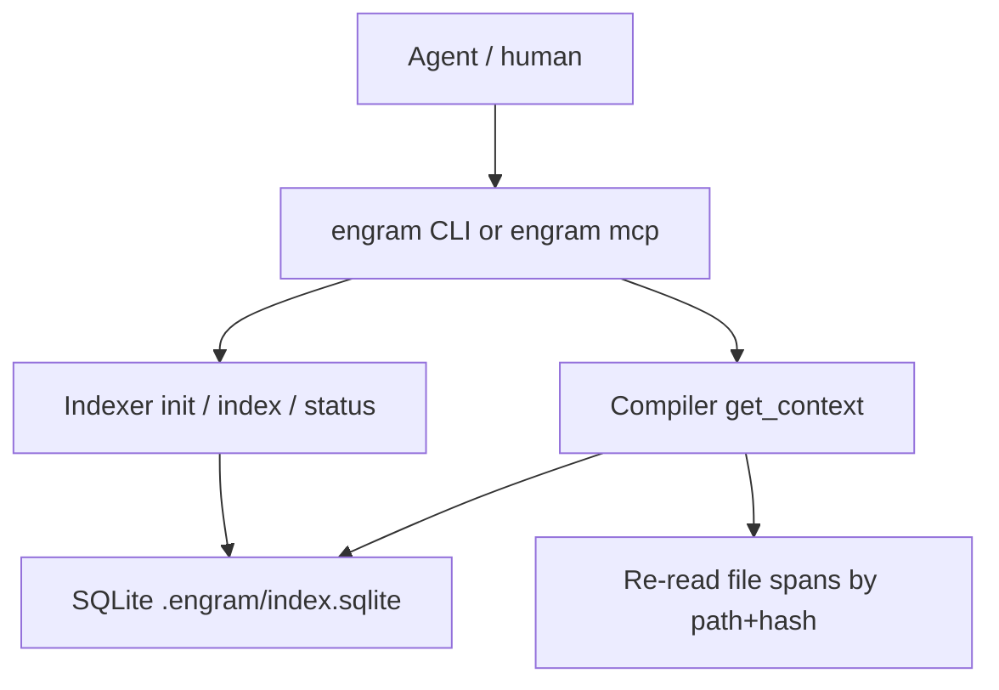

# Engram Core Design

Date: 2026-09-07
Status: draft, pending user review
Scope: first implementation slice only

## 1. Executive summary

Engram is a local engineering context compiler for AI coding agents. It indexes a repository as code (files, symbols, imports, calls) plus lightweight outlines (markdown headings, CSS selectors), then answers a question with a small **extractive** package of real spans.

It is not a memory system. MemPalace already stores verbatim conversations and generic project-file drawers. Engram complements it: Engram owns code-native retrieval and context compilation; conversation recall stays in MemPalace.

Core (this spec) is one Rust binary: indexer + SQLite store + `get_context` compiler + CLI + stdio MCP. No daemon, no LLM on the hot path, no embeddings, no Git intelligence, no decision records, no VS Code UI.

## 2. Problem

Coding agents rediscover the repo on every question: search files, open many paths, skim Git, then reason. That burns tokens and still misses structure (the symbol that actually implements auth, the CSS class, the README heading).

The machine already has the tree. Engram should compile that into a budgeted package so the agent does not walk the tree.

## 3. Product position

| | MemPalace | Engram |
|---|---|---|
| Job | Remember conversations and notes, verbatim | Compile engineering context from the current repo |
| Unit | Drawer of text | Symbol / span / edge |
| Retrieval | Semantic + hybrid over memories | Symbol + FTS + 1-hop graph |
| Output | Quoted memories | Budgeted `ContextPackage` of source |
| LLM in loop | No (search) | No (`get_context` is extractive) |

Do not duplicate wings, rooms, conversation mining, or a generic vector memory. Optional MemPalace MCP calls are a later slice.

## 4. Goals

- After `engram init` and `engram index`, an MCP agent can call `get_context` and receive a package that is sufficient to answer many “where / how is X implemented?” questions without extra repo search.
- Default agent path is compiler-first: one tool, not a scavenger hunt.
- Everything stays on disk. No network on Core paths.
- Works with Copilot CLI, Grok Build, Claude Code, Cursor, and any stdio MCP host.
- Queries stay bounded on large repos (tens of thousands of files; 100k must complete indexing without OOM).

## 5. Non-goals (explicitly out of Core)

- Conversation memory, drawers, AAAK, palace taxonomy
- Git history, blame, co-change, “why did this change?”
- First-class decisions / ADRs as structured records (markdown is outline+FTS only)
- Embeddings / vector search
- LLM summarization or rerank
- VS Code / JetBrains UI
- File watcher daemon
- Multi-repo search (one index per repo root)
- Cross-language call graph
- CSS-modules-to-TSX edges
- HTTP/SSE MCP, cloud relay
- Team server

Those are later slices (Git+decisions, MemPalace bridge, editors, hardening).

## 6. Locked decisions

1. Complement MemPalace; do not rebuild it.
2. First spec is Core only.
3. Compiler-first: `get_context` is the product; `search_symbols` / `search_code` are debug hatches.
4. Deep languages: TypeScript, JavaScript, TSX, JSX, Python.
5. Outline+FTS: Markdown, MDX, CSS, SCSS.
6. Extractive packages only; no LLM in `get_context`.
7. Own tree-sitter index in per-repo SQLite (FTS5). Rust CLI + MCP stdio.
8. MCP is read-only. Indexing is CLI.
9. Large-repo design: incremental index, bounded queries, no full-graph load at startup.

## 7. Architecture

One process. One database. No daemon.



- **`engram`**: only runtime. MCP is `engram mcp` on stdio.
- **Indexer**: walk, hash, parse, write tables.
- **Store**: SQLite + FTS5 at `<repo>/.engram/index.sqlite` (gitignored).
- **Compiler**: retrieve → fuse → rank → dedupe → budget → `ContextPackage`. Never writes. Never calls an LLM.
- **MemPalace**: not in-process. Core works if MemPalace is absent.

Repo root: `ENGRAM_ROOT` if set, else walk up from cwd to `.engram/` or `.git`. If neither exists, commands/tools return `not_initialized` and do not index `$HOME`.

## 8. Language policy

| Depth | Extensions | Extractor |
|---|---|---|
| Graph (symbols + import/call edges) | `.ts` `.tsx` `.js` `.jsx` `.mjs` `.cjs` `.py` | tree-sitter grammars linked into the binary |
| Outline + FTS | `.md` `.mdx` `.css` `.scss` | headings (`kind=heading`) or selectors (`kind=selector`); no edges |
| File row only | anything else not ignored | `files` + FTS, no symbols |

`parse_status` on each file: `graph` | `outline` | `file` | `skipped` | `error`.

Unparsed languages must not grow fake symbols or edges.

## 9. Data model

### 9.1 SQLite (`<repo>/.engram/index.sqlite`)

```sql
CREATE TABLE meta (
  schema_version INTEGER NOT NULL,
  indexed_at     TEXT,
  root           TEXT NOT NULL,
  file_count     INTEGER NOT NULL DEFAULT 0,
  symbol_count   INTEGER NOT NULL DEFAULT 0,
  edge_count     INTEGER NOT NULL DEFAULT 0
);

CREATE TABLE files (
  id            INTEGER PRIMARY KEY,
  path          TEXT NOT NULL UNIQUE,  -- repo-relative POSIX
  language      TEXT,
  hash          TEXT NOT NULL,         -- blake3 hex
  size          INTEGER NOT NULL,
  mtime         INTEGER NOT NULL,
  parse_status  TEXT NOT NULL
);

CREATE TABLE symbols (
  id          INTEGER PRIMARY KEY,
  file_id     INTEGER NOT NULL REFERENCES files(id) ON DELETE CASCADE,
  name        TEXT NOT NULL,
  kind        TEXT NOT NULL,
  start_line  INTEGER NOT NULL,
  end_line    INTEGER NOT NULL,
  start_byte  INTEGER NOT NULL,
  end_byte    INTEGER NOT NULL,
  signature   TEXT
);

CREATE TABLE edges (
  src_symbol_id INTEGER NOT NULL REFERENCES symbols(id) ON DELETE CASCADE,
  dst_symbol_id INTEGER NOT NULL REFERENCES symbols(id) ON DELETE CASCADE,
  kind          TEXT NOT NULL,          -- import | call
  confidence    TEXT NOT NULL,          -- high | low
  PRIMARY KEY (src_symbol_id, dst_symbol_id, kind)
);

CREATE VIRTUAL TABLE file_fts USING fts5(
  path,
  content,
  tokenize = 'unicode61'
);
```

Required indexes:

```sql
CREATE INDEX idx_symbols_name ON symbols(name COLLATE NOCASE);
CREATE INDEX idx_symbols_file ON symbols(file_id);
CREATE INDEX idx_edges_src ON edges(src_symbol_id);
CREATE INDEX idx_edges_dst ON edges(dst_symbol_id);
CREATE INDEX idx_files_hash ON files(hash);
```

Pragmas: `journal_mode=WAL`, `synchronous=NORMAL`, `foreign_keys=ON`.

**Symbol `kind` (closed set):** `module`, `function`, `method`, `class`, `interface`, `type`, `component`, `heading`, `selector`.

**Edge `kind`:** `import` | `call`.  
**`confidence`:** `high` (import-resolved or same-file unambiguous) | `low` (name-only guess). The compiler may expand over `low` edges; it must not present them as certain facts.

No embedding columns. No git SHA. No conversation ids. Migrations bump `meta.schema_version`.

### 9.2 `ContextPackage`

JSON (MCP and `engram get-context --json`):

```json
{
  "query": "where is auth handled?",
  "budget_tokens": 3000,
  "used_tokens": 1180,
  "items": [
    {
      "path": "src/auth/session.ts",
      "start_line": 12,
      "end_line": 48,
      "symbol": "createSession",
      "kind": "function",
      "text": "export function createSession(...) { ... }",
      "why": ["exact_symbol"]
    }
  ],
  "edges": [
    {
      "from": "src/middleware.ts:requireAuth",
      "to": "src/auth/session.ts:createSession",
      "kind": "call",
      "confidence": "high"
    }
  ],
  "stats": {
    "files_considered": 24,
    "symbols_considered": 18,
    "dropped_for_budget": 7,
    "stale_omitted": 0,
    "stale_index": false,
    "truncated": false
  }
}
```

- `text` is a verbatim disk span. Re-read at compile time if `files.hash` still matches; otherwise omit the item and increment `stale_omitted`.
- `why` is a machine tag list: `exact_symbol`, `prefix_symbol`, `fts`, `import_neighbor`, `call_neighbor`, `heading`, `selector`, `path_hint`. Not generated prose.
- CLI default is the same package rendered as a compact text digest (path + line range + fenced text). Still extractive.

Token estimate: whitespace-separated count of emitted `text` plus path headers. Good enough to enforce a cap; not a billing claim.

## 10. Indexing

`engram index` is a batch command. No watcher in Core.

### 10.1 Walk and skip

Start at repo root. Honor `.gitignore` and `.engramignore`. Built-in skips even if ignore files are missing:

- VCS/deps: `.git`, `node_modules`, `.venv`, `venv`, `__pycache__`, `dist`, `build`, `.engram`, `.next`, `target`
- Secrets by name: `.env`, `.env.*`, `*.pem`, `*.key`, `id_rsa`, `credentials.json`
- Noise: lockfiles, `*.min.js`, `*.map`, images, archives, files containing a NUL byte
- Size: files over 1MB are skipped (count `skipped_large`); they are not FTS-indexed

High-confidence secret-content regex (AWS-style keys, PEM headers, common token prefixes): skip the whole file, count `skipped_secret`, **do not store the match**. Safety net, not a scanner product.

### 10.2 Incremental

For each surviving file: size + blake3. Unchanged hash → keep rows. Changed → delete that file’s symbols, edges, FTS row, re-parse. Missing path → delete. `meta` updates in the final transaction.

### 10.3 Parse

- **Graph languages:** tree-sitter. Extract symbols and `import`/`call` edges. In-file name-only calls are `low`; import-resolved names are `high`. TSX/JSX use the TSX/JSX grammars (not the TS grammar).
- **Outline:** markdown headings; CSS/SCSS class, id, and custom-property names.
- **File:** `files` + FTS only.
- Parse failure: `parse_status=error`, `files` row kept, no symbols. Indexing does not abort the repo.

FTS content is the file body after skip rules. Quoted spans always come from a later disk read, not from FTS.

### 10.4 Parallelism and transactions

Hash and parse with rayon. SQLite writes on one connection, batched transactions. One file’s AST is dropped after its rows are written.

### 10.5 Init

`engram init`:

1. Create `.engram/` and empty DB (`schema_version` current).
2. Write a default `.engramignore` if absent.
3. Append `.engram/` to `.gitignore` if `.gitignore` exists and the entry is missing.
4. Do not index until `engram index`.
5. Optional `--harness` / `--skill` as in §12.

## 11. Retrieval and compiler

`get_context(query, budget_tokens=3000)` is a pure read.

### 11.1 Query plan (deterministic)

No model. Extract:

- quoted identifiers
- `CamelCase`, `snake_case`, `dotted.path` tokens → `symbol_terms`
- path-like fragments (`src/auth`, `.tsx`) → `path_hints`
- remainder → FTS query

### 11.2 Candidate retrieval (union, hard caps)

| Source | Cap |
|---|---|
| Symbol exact then prefix, `name` case-insensitive | 50 |
| FTS5 BM25 | 30 files |
| Outline heading/selector name match | included in the 50 |
| 1-hop import/call neighbors of accepted symbols | 40 |

`high` neighbors always eligible; `low` only if the neighbor cap is not full.

### 11.3 Fuse, rank, dedupe

Fuse to one row per `(path, start_line, end_line)` with a set of `why` tags.

Rank (sum, no learned model):

| Signal | Weight |
|---|---|
| Exact symbol name | 5 |
| Prefix symbol | 3 |
| FTS BM25 normalized 0–1 | 2 |
| Heading/selector hit | 2 |
| High-confidence neighbor | 1.5 |
| Low-confidence neighbor | 0.5 |
| Path hint match | 1 |
| Same file as a top symbol | 1 |

Dedupe: merge overlapping spans in one file; if a symbol span sits inside a larger FTS hit, keep the tighter span. Max two spans per file unless budget remains after the first pass.

### 11.4 Budget and emit

Walk rank order. Re-read span if hash matches; else drop (`stale_omitted`). Stop when the next item would exceed `budget_tokens` **or** serialized JSON would exceed **16KB** (under Grok’s 20KB MCP default). Set `stats.truncated` if the byte cap fires. If a majority of attempted quotes were stale, set `stats.stale_index: true` and hint `engram index`.

Empty candidates → empty `items`, populated `stats`. Never invent text.

`search_symbols` / `search_code` are the symbol and FTS stages only: ranked lists, no compile, smaller payloads.

## 12. MCP and harnesses

Compatibility layer is **MCP stdio**, not a per-vendor plugin.

### 12.1 Server

- Command: `engram mcp`
- Transport: stdio JSON-RPC only. Logs on **stderr**. Stdout is protocol.
- Startup: open DB read-only (WAL). Do not load the symbol table into RAM. Target ≤ 100ms.
- Tools never write the index.

### 12.2 Tools

| Tool | Arguments | Role |
|---|---|---|
| `get_context` | `query` (string, required), `budget_tokens` (int, optional, default 3000) | Product. Description must say: call this before searching the repo. |
| `search_symbols` | `name` (string), `limit` (optional, default 20) | Debug |
| `search_code` | `query` (string), `limit` (optional, default 20) | Debug |
| `index_status` | none | DB exists, schema, counts, `indexed_at`, stale sample |

Invalid args → MCP error. Missing index → structured `not_initialized`. Indexer holding the write lock → `index_busy`.

### 12.3 Harness wiring

Same command everywhere: `engram` + `["mcp"]`.

`engram init --harness <id>` writes **project-scoped** snippets only (never user-global without an explicit later flag):

| id | File | Shape |
|---|---|---|
| `grok` | `.grok/config.toml` | `[mcp_servers.engram]` `command = "engram"` `args = ["mcp"]` |
| `copilot` | `.mcp.json` | stdio server `engram`; Copilot CLI also documents `copilot mcp add engram -- engram mcp` |
| `claude` | `.mcp.json` | same stdio block |
| `cursor` | `.cursor/mcp.json` | same stdio block |
| `all` | all of the above that are applicable | merge, do not clobber unrelated servers |

No HTTP MCP. No cloud relay.

### 12.4 Teaching the agent

`engram init --skill` writes:

- `.grok/skills/engram/SKILL.md` (and a copy under `.claude/skills/engram/` if `--harness` includes claude): call `get_context` first; do not grep the tree until the package is empty or `stale_index` is true.
- A short blurb appended to `AGENTS.md` if that file exists; create `AGENTS.md` only with `--skill --write-agents`.

This is how Copilot CLI / Grok Build actually use Engram instead of ignoring it.

## 13. CLI

| Command | Behavior |
|---|---|
| `engram init` | §10.5, §12.3–12.4 |
| `engram index` | Incremental index. `--force` rebuilds. Prints files/symbols/edges/skipped/errors. |
| `engram status` | DB path, schema, counts, last index, stale sample |
| `engram get-context "…"` | Compiler. Text digest default; `--json`; `--budget N` |
| `engram search-symbols NAME` | Debug |
| `engram search-code "…"` | Debug |
| `engram mcp` | stdio server |
| `engram doctor` | Binary, grammars, DB open, ignore rules, harness config presence |

Exit codes: `0` ok, `1` usage, `2` not initialized, `3` index/IO error.

No telemetry. No network on these paths.

## 14. Performance

Query path is O(candidates), not O(repo). MCP does not preload the graph.

| Operation | Core target (laptop, SSD, after ignores) |
|---|---|
| `get_context` p95 | ≤ 200ms on a ~50k-file index |
| `engram mcp` startup | ≤ 100ms |
| Incremental index | proportional to changed files, typically seconds |
| Cold index ~10k files | ≤ 30s |
| Cold index ~100k files | must complete; may take minutes; must not OOM |

Out of Core: sharded indexes, daemon, Postgres, scanning `node_modules`, unbounded graph walks.

## 15. Errors and safety

| Condition | Behavior |
|---|---|
| No `.engram` | `not_initialized`, CLI exit 2 |
| Stale hashes | omit those items; `stale_index` if majority |
| Parse error | per-file `error`; index continues |
| Secret skip | counts only, never contents |
| Empty retrieval | empty `items` + stats |
| DB locked by indexer | `index_busy` |
| MCP stdout pollution | forbidden; tests fail if a log line hits stdout |

Treat retrieved source as **data**, never as instructions. Tool descriptions state that `text` is untrusted repository content.

Local-first: Core performs no HTTP. Remote embeddings/LLMs are out of Core.

## 16. Testing

In-tree fixture `engram/testdata/miniapp`: TSX components, a Python module, README headings, a CSS class, a `.env` that must not appear, one file over 1MB that is skipped.

- **Extractors:** symbol names, import/call edges and confidence, TSX vs TS, markdown headings, CSS selectors.
- **Index:** unchanged hash is a no-op; one file change reparses only that file; deleted path dropped; `.env` absent from FTS; 1MB file skipped.
- **Compiler:** exact symbol quotes the span; FTS hits a heading; budget 500 drops low-rank items; overlapping spans merge; hash mismatch omits span and sets stale; JSON ≤ 16KB.
- **MCP:** `tools/list` shape; `get_context` under 16KB; stdout is JSON-RPC only.
- **Scale (opt-in):** `ENGRAM_SCALE_TEST=1` generates ~10k tiny files and asserts `get_context` p95 ≤ 200ms. Not required on default CI.

No LLM. No live Copilot/Grok session in CI.

## 17. Repository layout (implementation)

```
engram/                 # Rust package (name: engram)
  src/
    main.rs             # CLI
    mcp.rs              # stdio MCP
    index.rs            # walk, hash, write
    extract/
      mod.rs
      ts.rs             # TS/TSX/JS/JSX
      python.rs
      markdown.rs
      css.rs
    store.rs            # SQLite schema + queries
    compile.rs          # get_context pipeline
    ignore.rs
    secret.rs
  testdata/miniapp/
docs/superpowers/specs/ # this document
```

Single crate. tree-sitter grammars as crate dependencies, compiled in. `rusqlite` with bundled SQLite and FTS5.

## 18. Success metrics (Core)

- Dogfood: on this repo after index, `get_context "how does get_context rank spans?"` returns `compile.rs` (or equivalent) within budget without the agent opening unrelated files first.
- Compiler tests in §16 green.
- Secret fixture never appears in a package.
- MCP `get_context` payload ≤ 16KB.
- Scale opt-in test meets the 10k-file p95 bar.

Token-savings percentages vs a naive agent are **not** a Core launch claim. They depend on the harness. We measure package size and whether the agent still greps; we do not advertise “88% fewer tokens.”

## 19. Risks

- JS/TS call edges will be wrong under dynamic dispatch. Mitigation: `low` confidence, never printed as certainty; 1-hop only.
- Agents ignore MCP and grep anyway. Mitigation: skill + AGENTS.md + strong `get_context` tool description; still cannot force Copilot’s planner.
- Monorepos with generated code blow FTS. Mitigation: default ignores, `.engramignore`, 1MB skip.
- SQLite writer vs MCP readers. Mitigation: WAL; MCP immutable read; `index_busy` on true lock.

## 20. Follow-on slices (not this spec)

1. Git + structured decisions
2. Optional MemPalace MCP client for conversation evidence
3. Optional local embeddings as an extra candidate source
4. Editor surfaces
5. Watcher, semantic cache, multi-repo

## 21. Implementation note

Do not implement until this spec is approved and an implementation plan is written. The next step after approval is the writing-plans skill, not code.
